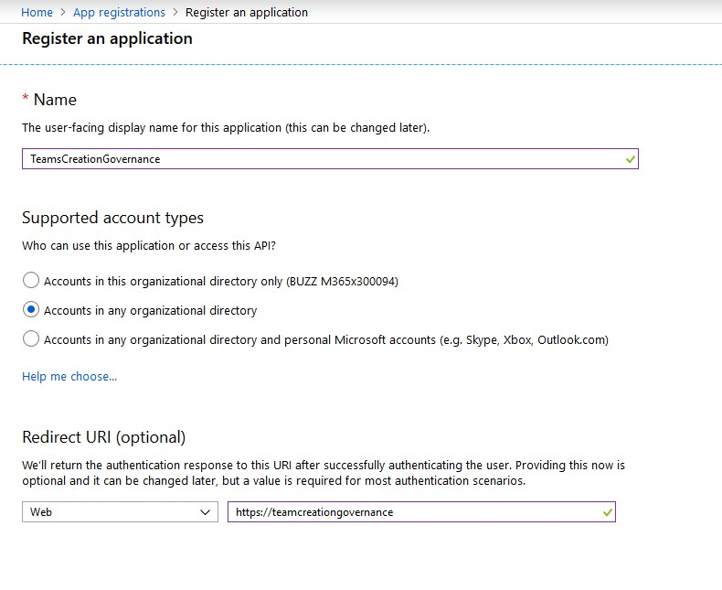
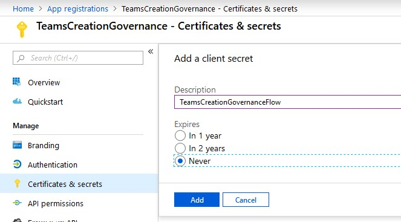
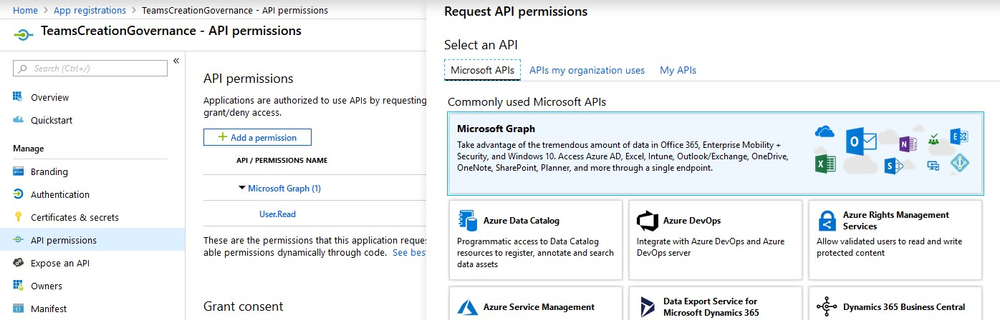
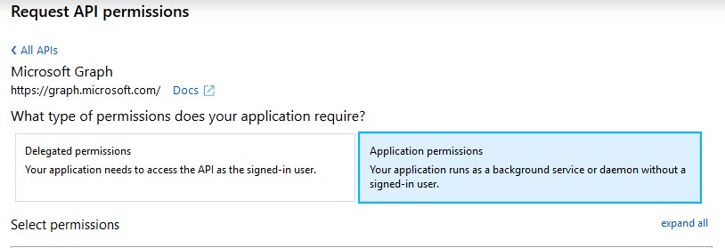
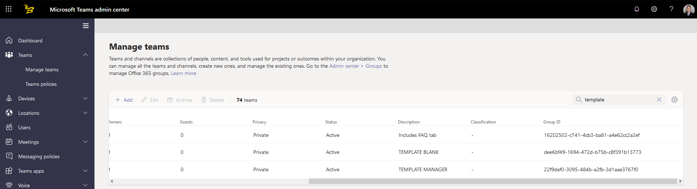
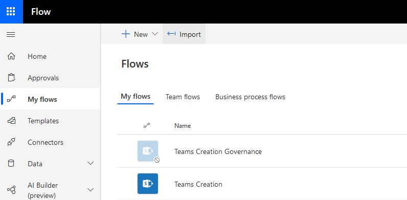
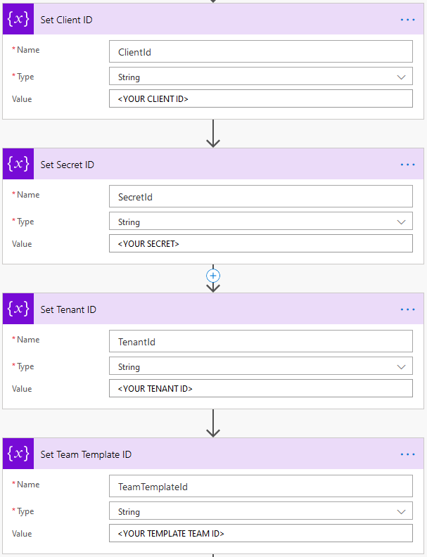

# Manager Team
Create a team in Microsoft Teams for a Manager and their direct reports. **TODO: PROVIDE THE USE CASE!**

## Steps
1. [Register an Application in Azure Active Directory](#register-an-application-in-azure-active-directory)
2. [Create a Template Team](#create-a-template-team)
3. [Import the flow](#import-the-power-automate-flow)

## Register an Application in Azure Active Directory
1. Browse to https://aad.portal.azure.com
2. Register a new application: https://portal.azure.com/#blade/Microsoft_AAD_RegisteredApps/ApplicationsListBlade

3. Copy the `Application (client) ID` and the `Directory (tenant) ID` from the Overview page into OneNote/notepad
4. Click on `Certificates & secrets` and create a new client secret (copy/paste it into OneNote/notepad)

5. Click on `API permissions` and add the following permissions for Microsoft Graph (Application, not delegated): **Group.ReadWrite.All**, **User.ReadWrite.All**, **Directory.ReadWrite.All**

6. Click the `Grant admin consent for [tenant]` button

## Create a Template Team
1. Create a team in Microsoft Teams and configure the channels and tabs according to your business needs
    - I usually prepend these teams with "TEMPLATE" in the title
    - You may want to create this team as a service account so you are not automatically an owner of every team that gets generated
2. Browse to https://admin.teams.microsoft.com
3. Click on `Teams` > `Manage teams`
4. Search for your TEMPLATE team
5. Scroll to the right until you see the Group ID column. You may have to expand the column header to the right to see the entire contents of the column
6. Copy the Group ID for your TEMPLATE team, we'll use that in the next step

## Import the Power Automate Flow
1. Browse to https://flow.microsoft.com
2. Click on `My flows`
3. Click `Import`

4. Download [ManagerTeam.zip](/ManagerTeam.zip) and upload your copy of this file (you may want to run/connect as a service account)
5. After importing, edit the Flow to plug in your IDs for the AAD Application and the Team ID for your template

6. Save the flow
7. Run the flow, providing a UPN for a user with direct reports